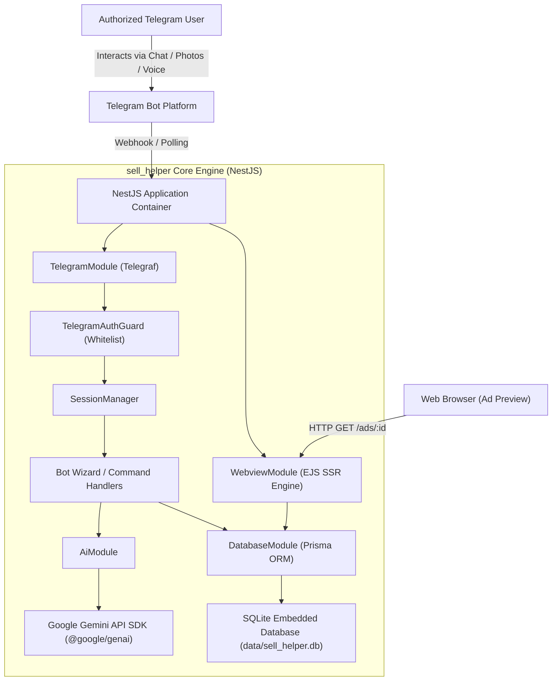
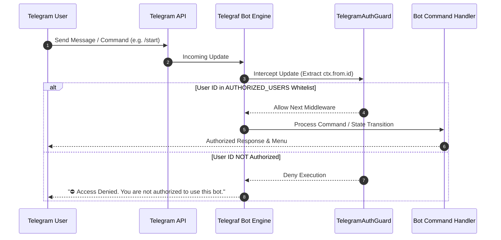
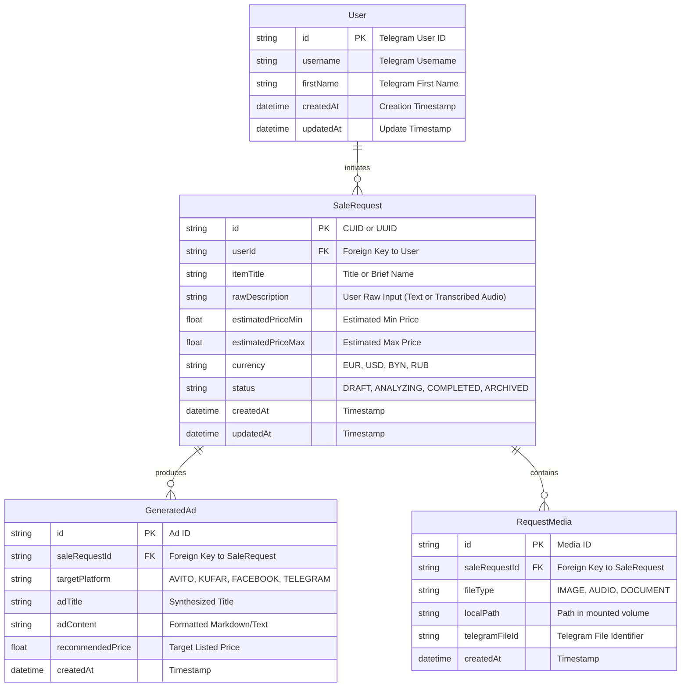

# System Architecture: sell_helper

## 1. System Overview & Vision
`sell_helper` is an autonomous, private, AI-augmented assistant designed to streamline the resale of used goods. It operates primarily as an interactive Telegram Bot backed by a robust NestJS backend. The system leverages the Google Gemini AI engine to perform multimodal item evaluation, market price estimation, multi-platform ad copy synthesis (e.g., Avito, Kufar, Facebook Marketplace, Telegram channels), and generates responsive Server-Side Rendered (SSR) web view previews.

Access is strictly private and restricted to authorized Telegram user IDs defined in the server environment configuration.

---

## 2. High-Level Architecture & Topography

The system runs as a containerized service deployed on local hardware (ZimaBoard running ZimaOS) or Linux hosts using Docker and Docker Compose.

---

## 3. Modular Architecture Breakdown

The backend is decomposed into decoupled, cohesive NestJS modules:

| Module | Core Responsibility | Key Services / Controllers |
| :--- | :--- | :--- |
| **`ConfigModule`** | Environment variable loading, schema validation, whitelist parsing | `ConfigService`, `.env` validation schema |
| **`DatabaseModule`** | Database connection pooling, SQLite persistence, migrations | `PrismaService`, Prisma Client |
| **`TelegramModule`** | Telegraf bot lifecycle, updates handling, auth guarding, scenes | `TelegramBotService`, `TelegramAuthGuard`, `BotUpdateHandler` |
| **`AiModule`** | Gemini AI client integration, price analysis, ad prompt generation | `GeminiAiService`, `PromptTemplateRegistry` |
| **`AdsModule`** | CRUD operations for item sale requests, generated ad texts, photos | `AdsService`, `AdsRepository` |
| **`WebviewModule`** | Server-side rendering (SSR via EJS) for clean ad preview pages | `WebviewController`, EJS view templates |

---

## 4. Security & Access Control Topology

### Whitelist Authorization Protocol
- Environment variable `AUTHORIZED_USERS` holds a comma-separated list of numeric Telegram User IDs (e.g., `123456789,987654321`).
- The `TelegramAuthGuard` intercepts all incoming updates (messages, callback queries, inline queries).
- If the sender's Telegram ID is not within the whitelist, the bot replies with a standard rejection message and terminates the pipeline immediately.

---

## 5. Domain Data Models (Prisma & SQLite)

---

## 6. Containerization & Storage Strategy

- **Base Image**: `node:22-alpine` (lightweight, secure).
- **Persistent Data & Configuration Volume**:
  - Configuration directory: `/app/data/config/.env` contains runtime environment variables, bot credentials, and access whitelist.
  - SQLite database file located at `/app/data/sell_helper.db`.
  - Media storage located at `/app/data/uploads/`.
- **Docker Compose Setup**: Single-service orchestration with host `./data` volume mounts preserving configuration, database, and media across container updates.

---

## 7. Quality Gate & Testing Strategy

- **Unit Testing**: Jest tests targeting guards, utility services, and state machines with minimum **75% code coverage**.
- **Mocking**: Full mock suites for Telegraf Context (`TelegrafContextMock`) and external AI SDK calls.
- **Static Analysis**: ESLint and Prettier integrated with GitHub Actions CI pipeline.
